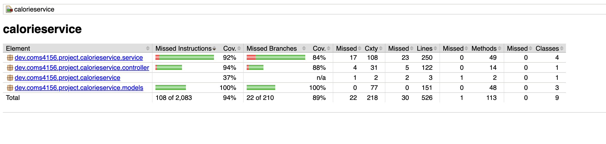

# 4156-Team-Project-2025 - Team Hello World
This is the GitHub repository for the **Team Project** associated with COMS 4156 Advanced Software Engineering.
Our group, **Hello World**, consists of the following members
- Arjun Somekawa (as7423)
- Jonathan Tavarez (jt3481)
- Songhee Beck (sb4446)
- Valentino Vitale (vv2343)

## Cloud URL
https://calorie-service-295107751003.us-east1.run.app

## Building and Running a Local Instance
In order to build and use our service you must install the following (This guide assumes MacOS but the Maven README has instructions for both Windows and Mac):

1. Maven 3.9.11: Run "mvn compile" and "mvn spring-boot:run". Running this command for the first time should install the necessary dependencies. If not use https://maven.apache.org/download.cgi to download and follow the installation instructions, be sure to set the bin as described in Maven's README according to instructions of your OS (see README).
2. JDK 17: This project used JDK 17 for development so that is what I recommend you use: https://www.oracle.com/java/technologies/javase/jdk17-archive-downloads.html
3. IntelliJ IDE: I recommend using IntelliJ but you are free to use any other IDE that you are comfortable with: https://www.jetbrains.com/idea/download/
4. To Run the code, you will need to have Google Credentials set up to use the FireStore Database. For testing purposes, email (jt3481@columbia.edu) for the credentials, and he will send them to you. After receiving the credentials, export them using the code below. 

export GOOGLE_APPLICATION_CREDENTIALS="/path/to/your/service-account.json"

After this, the tests and service will work for you locally.

5. When you open IntelliJ you have the option to clone from a GitHub repo, click the green code button and copy the http line that is provided there and give it to your IDE to clone.
6. That should be it in order to build the project with maven you can run <code>mvn -B package --file pom.xml</code> and then you can either run the tests via the test files described below or the main application by running SweProjectApplication.java from your IDE.
7. If you wish to run the style checker you can with <code>mvn checkstyle:check</code> or <code>mvn checkstyle:checkstyle</code> if you wish to generate the report.
8. If you wish to run the unit tests (which can be found in /CalorieService/src/test/java/dev/coms4156/project/calorieservice), you can with <code>mvn clean test</code> and <code>mvn jacoco:report</code>, which generates a report in /CalorieService/target/site/jacoco/index.html.
9. If you wish to run static analysis of the code base, you can with <code>mvn pmd:check</code>.
10. All CI/CD development logic for Github Actions are set up in /.github/workflows/java-build.yml, which tests code pushed to main or dev branches of your repo.

# List of all Endpoints

## RouteController.java
#### /food/alternative
* HTTP Method: GET
* Expected Input Parameters: foodId (int)
* Expected Output: foodAlternatives (ResponseEntity<?>)
* Returns 5 random foods of the same food category with lower calorie count.
* Status Codes:
  * 200 OK: Successfully retrieved food alternatives or no alternatives found
  * 404 NOT FOUND: Food with specified ID not found
  * 500 INTERNAL SERVER ERROR: Server error occurred

#### /recipe/alternative
* HTTP Method: GET
* Expected Input Parameters: recipeId (int)
* Expected Output: recipeAlternatives (ResponseEntity<?>)
* Returns 3 recipes of same recipe category with lower calorie count and 
highest views, as well as 3 random recipes of the same category with lower calorie count.
* Status Codes:
  * 200 OK: Successfully retrieved recipe alternatives
  * 404 NOT FOUND: Recipe with specified ID not found
  * 500 INTERNAL SERVER ERROR: Server error occurred

#### /recipe/totalCalorie
* HTTP Method: GET
* Expected Input Parameters: recipeId (int)
* Expected Output: calorie (ResponseEntity<?>)
* Returns the estimated total calorie of a given recipe.
* Status Codes:
  * 200 OK: Successfully calculated total calories
  * 404 NOT FOUND: Recipe with specified ID not found
  * 500 INTERNAL SERVER ERROR: Server error occurred

#### /recipe/calorieBreakdown
* HTTP Method: GET
* Expected Input Parameters: recipeId (int)
* Expected Output: calorieBreakdown (ResponseEntity<?>)
* Returns a dict of each ingredient in recipe and estimated calorie value for that ingredient.
* Status Codes:
  * 200 OK: Successfully retrieved calorie breakdown
  * 404 NOT FOUND: Recipe with specified ID not found
  * 500 INTERNAL SERVER ERROR: Server error occurred

#### /client/recommend
* HTTP Method: GET
* Expected Input Parameters: clientId (int)
* Expected Output: recipes (ResponseEntity<?>)
* Returns a list of 10 recommended recipes based on client's liked recipes.
* Status Codes:
  * 200 OK: Successfully retrieved recommendations or no recommendations found
  * 404 NOT FOUND: Client with specified ID not found
  * 500 INTERNAL SERVER ERROR: Server error occurred

#### /client/recommendHealthy
* HTTP Method: GET
* Expected Input Parameters: clientId (int), calorieMax (int)
* Expected Output: recipes (ResponseEntity<?>)
* Returns a list of 10 recommended recipes based on client's liked recipes under the calorieMax value.
* Status Codes:
  * 200 OK: Successfully retrieved healthy recommendations or no recommendations found
  * 404 NOT FOUND: Client with specified ID not found
  * 500 INTERNAL SERVER ERROR: Server error occurred

#### /client/likeRecipe
* HTTP Method: POST
* Expected Input Parameters: clientId (int), recipeId (int)
* Expected Output: status (ResponseEntity<?>)
* Adds a recipe to client's likedRecipes.
* Status Codes:
  * 200 OK: Recipe successfully added to client's liked recipes
  * 400 BAD REQUEST: Client/recipe not found or recipe already liked
  * 500 INTERNAL SERVER ERROR: Server error occurred

#### /recipe/addRecipe
* HTTP Method: POST
* Expected Input Parameters: recipe (Recipe)
* Expected Output: status (ResponseEntity<?>)
* Adds a recipe to service.
* Status Codes:
  * 201 CREATED: Recipe successfully added
  * 400 BAD REQUEST: Recipe payload is invalid or recipe ID is missing
  * 409 CONFLICT: Recipe with specified ID already exists
  * 500 INTERNAL SERVER ERROR: Server error occurred

#### /food/addFood
* HTTP Method: POST
* Expected Input Parameters: food (Food)
* Expected Output: status (ResponseEntity<?>)
* Adds a food to service.
* Status Codes:
  * 200 OK: Food successfully added
  * 400 BAD REQUEST: Food object is null, invalid, or ID already exists
  * 500 INTERNAL SERVER ERROR: Server error occurred

#### /recipe/viewRecipe
* HTTP Method: POST
* Expected Input Parameters: recipeId (int)
* Expected Output: status (ResponseEntity<?>)
* Increment Recipe's Views.
* Status Codes:
  * 200 OK: Recipe view successfully recorded
  * 404 NOT FOUND: Recipe with specified ID not found
  * 500 INTERNAL SERVER ERROR: Server error occurred

#### /recipe/likeRecipe
* HTTP Method: POST
* Expected Input Parameters: recipeId (int)
* Expected Output: status (ResponseEntity<?>)
* Increment Recipe's likes.
* Status Codes:
  * 200 OK: Recipe like successfully recorded
  * 404 NOT FOUND: Recipe with specified ID not found
  * 500 INTERNAL SERVER ERROR: Server error occurred

## Client Application (Demo Client)
Our project includes a full React-based demo client located inside this repository at CalorieService/recipe-client/, as well as helper java files located in CalorieService/src/main/java/dev/coms4156/project/calorieservice/client, CalorieService/src/main/java/dev/coms4156/project/calorieservice/config and CalorieService/src/main/java/dev/coms4156/project/calorieservice/controller.

This client provides a graphical interface for interacting with many of the major API endpoint of the Calorie Service. It is used during local development, end-to-end testing, and during our final demo. It should be noted that this demo client serves as an example of what can be made using this service. While this client acts as a recipe recommendation site, another client could easily be made with another purpose, such as a restaurant menu calorie estimator.

### What the Client Does
The demo client allows a client to:
- Sign in with a local client ID
- Get recommended recipe recommendations based on calorie restrictions from the service
- View recipe details and ingredient calorie breakdowns
- Like recipes (which records likes both within the client data-store and in the service's DB)

The client communicates directly with the backend service deployed at: https://calorie-service-295107751003.us-east1.run.app/. All network calls are made using a lightweight proxy layer defined in CalorieService/recipe-client/src/App.jsx.

### How to Build and Run the Client
From the repository root, run:
1. cd CalorieService/recipe-client
2. npm install     (first time only)
3. npm run dev

Then open a browser to:
http://localhost:5173.

You must also run <code>mvn spring-boot:run</code> which will start the client's backend. This is used for our demo-client specific log calls.

Your client is now connected to the backend service and ready for E2E testing.

Your client currently uses client id 516 found in line 4 of App.jsx. You will need to change this to your own client id if you are making your own client.

### How Multiple Client Instances Are Distinguished
The service was explicitly designed to handle multiple simultaneous clients.
The demo client identifies itself to the server using three independent identifiers:

1. X-Client-Id: A static ID for the entire client application (example: 502).
This distinguishes different client types.
2. X-Instance-Id: A random UUID generated per browser installation and stored in localStorage.
This distinguishes multiple clients.
3. clientId: A human-readable client identity meaningful to the UI (ex: "alice01").
It identifies which local person is currently interacting with the client.

Due to this, multiple instances can interact with the service simultaneously without interfering with each other, and logs clearly indicate which instance and client produced each call. You may use the test files as proof of this behavior: MultiClientLogTests.java and MultiClientRouteControllerTest.java.

### How to Test the Client
Our demo-client has a features to assist developers when it comes testing their code. Below is a list of the test files and how to run them.

#### CalorieService/recipe-client/src/App.test.jsx
CalorieService/recipe-client/src/App.test.jsx contains a thorough test file with tests for App.jsx. These tests are used to check as many plausible equivalence partitions for the Client front-end behavior. It is built using Jest.

You can run this test, alongside app.e2e.spec.js when you run <code>npm test</code> from the recipe-client directory. Reports are generated in /CalorieService/recipe-client/coverage/lcov-report/index.html.

#### CalorieService/recipe-client/tests/app.e2e.spec.jsx
CalorieService/recipe-client/tests/app.e2e.spec.jsx contains a test file with end-to-end tests for App.jsx. It is built using Playwright.

You can run the following steps to test the e2e test files from the recipe-client directory:
1. npx playwright install (first time only)
2. npx playwright test

Reports are generated in /CalorieService/recipe-client/test-results/.last-run.json.

These tests cover the following flows:
1. Client can sign in end-to-end: Validates UI changes + /client/log.
2. Fetching healthy recipe recommendations: covers the /client/recommendHealthy endpoint.
3. Viewing recipe details: covers /recipe/viewRecipe and /recipe/calorieBreakdown.
4. Liking a recipe: Covers /client/likeRecipe functionality via LIKE button.
5. Multiple browser instances: Ensures different windows generate different instanceIds.
6. Backend error handling: Validates client error bar display on invalid inputs.

All tests communicate with the real client-backend and require both the service and the client to be running.

#### CalorieService/src/test/java/dev/coms4156/project/calorieservice
This directory contains many test files that test supporting features and capabilities found in ClientEvent.java, CoreConfig.java and ClientLogController.java (see start of this subsection). Corresponding test files are found in CalorieService/src/test/java/dev/coms4156/project/calorieservice and are automatically ran as part of the CI (see <code>mvn clean test</code>).

1. ClientEventTests.java: Tests the ClientEvent.java file.
2. ClientLogTests.java: Tests the backend component of the client which handles client-based logging. Note that /CalorieService/logs/client-events.log serves as a local persistent data store for the client.
3. MultiClientLogTests.java: Tests the behavior of a client querying the client (eg. using the client to log into their account the recipe site) and tests for multi-client behavior.
4. MultiClientRouteController.java: Tests the behavior of a client querying the service (eg. using the service to get recipes that meet the health criteria) and tests for multi-client behavior. Contains many equivalence partitions for Client -> Service Inputs.

## Third-Party Client Developer Guide
Any third-party developer can build their own client by following these guidelines.

### 1. API Base URL
All service endpoints are exposed at: https://calorie-service-295107751003.us-east1.run.app/

A third-party client can use any language or environment that supports HTTP calls.

### 2. Required Headers
Every request must include:
- X-Client-Id: <integer identifying the client application>
- X-Instance-Id: <unique ID per installation>

Clients may generate instance IDs however they choose (UUID recommended).

### 3. Authentication / Client Context
Your service uses lightweight, client-managed identifiers:
- clientId (query param)
- recipeId (query param)

There is no OAuth or authentication requirement.

### 4. Supported API Endpoints
Full endpoint documentation appears earlier in the README.
Third-party clients may implement any subset they require.

All responses use JSON.

### 5. Logging Requirement
All clients must POST to POST /client/log with a JSON body describing:
- instanceId
- serviceClientId
- clientId
- timestamp
- action event (sign in, view, like, etc.)

This ensures observability across multiple client instances.

## Project Management Tools
We used a combination of Jira and a spreadsheet to keep track of tasks. These are the links to them.
- https://arjunsomekawa.atlassian.net/jira/software/projects/OPS/boards/1?atlOrigin=eyJpIjoiNWY5ZmRkNjQxMWEyNGI0Y2FmZjRjMzBiZWMwNmY0NWYiLCJwIjoiaiJ9
- https://docs.google.com/spreadsheets/d/1q3fpW9lZYhbR_of1h09LZfC2FTuzpdeuxaPmUfPsXw8/edit?usp=sharing

## Style Checking Report
I used the tool "checkstyle" to check the style of our code and generate style checking reports. Here is the report
as of the day of Dec 04, 2025. (These can be found in the reports folder):

Our Style Checking Ruleset is google_checks.xml.

## Branch Coverage Reporting
I used JaCoCo to perform branch analysis in order to see the branch coverage of the relevant code within the code base. See below
for screenshots demonstrating output.

## Static Code Analysis
I used PMD to perform static analysis on our codebase, see below for the most recent output.

This image was captured on Dec 04, 2025.

## Jest Testing
I used Jest to perform end-to-end testing for our client's backend, see below for the most recent output.

This image was captured on Dec 04, 2025.

## Playwright Testing
I used Jest to perform end-to-end testing for our service, see below for the most recent output.

This image was captured on Dec 04, 2025.

## Continuous Integration Report
This repository using GitHub Actions to perform continuous integration, to view the latest results go to the following link: https://github.com/Arjunj99/4156-Miniproject-2025-Students-part-3/actions

## Discussion of Endpoint Ordering
As a group, we discussed and decided that for our project, Endpoint Ordering does not matter.

## Postman Test Documentation
We used Postman to document and store our API endpoints/results. here is a link to access our API endpoints with sample responses (https://app.getpostman.com/join-team?invite_code=bc1fd36ae7da43f92c0d6aa188720c38c33af18b17aeaa68d339fffbe5decb95&target_code=5bd0b449f27ac1df88f67582412ba439).

## Tools used 
This section includes notes on tools and technologies used in building this project, as well as any additional details if applicable.

* Maven Package Manager
* GitHub Actions CI
    * This is enabled via the "Actions" tab on GitHub.
    * Currently, this just runs a Maven build to make sure the code builds on branch 'main'.
* Checkstyle
    * I use Checkstyle for code reporting. Note that Checkstyle does get run as part of the CI pipeline.
* PMD
    * I am using PMD to do static analysis of our Java code.
* JUnit
    * JUnit tests get run automatically as part of the CI pipeline.
* Spring Boot Test + MockMvc + Hamcrest
    * I use Spring Boot Test with MockMvc to exercise the HTTP endpoints end-to-end (RouteControllerTests, InternalIntegrationTests, ExternalIntegrationTests). My JSON assertions rely on Hamcrest matchers such as `hasItem`, `not`, and `containsString`. EndToEndTests run with `SpringBootTest(webEnvironment = RANDOM_PORT)` and `TestRestTemplate`, using Firestore credentials so they send real HTTP traffic through the stack.
* JaCoCo
    * I use JaCoCo for generating code coverage reports.
* Mockito
    * We used Mockito to mock our MockAPIService to do isolated testing of RouteController.
* Postman
    * We used postman to test that out API works.
* Playwright 
    * We used Playwright for automated end-to-end testing of the client against the deployed cloud backend. 
* Jest + React Testing Library 
    * Jest is used for unit testing the React client. 
* Vite 
    * We use Vite as the development server and bundler for the demo client.

# Equivalence Partitions
## Client Model

### Valid Partition

#### Valid client with liked recipes
- **Sample Input:** `new Client(501, likedRecipesList)`
- **Expected Outcome:** Client object created with clientId=501 and likedRecipes list
- **Test:** ClientUnitTests.completeArgsConstructorValidInputTest()

#### Valid client with empty liked recipes
- **Sample Input:** `new Client(502, new ArrayList<>())`
- **Expected Outcome:** Client object created with empty likedRecipes list
- **Test:** ClientUnitTests.noArgsConstructorTest()

#### Add recipe to liked recipes
- **Sample Input:** `client.addLikedRecipe(recipe)`
- **Expected Outcome:** Recipe added to likedRecipes list
- **Test:** ClientUnitTests.likeRecipeSuccessTest()

### Invalid Partition

#### Negative clientId
- **Sample Input:** `new Client(-1, likedRecipesList)`
- **Expected Outcome:** IllegalArgumentException with message "Client ID cannot be negative"
- **Test:** ClientUnitTests.setClientIdInvalidInputTest()

#### setClientId with negative value
- **Sample Input:** `client.setClientId(-100)`
- **Expected Outcome:** IllegalArgumentException with message "Client ID cannot be negative"
- **Test:** ClientUnitTests.setClientIdInvalidInputTest()

#### null liked recipes list
- **Sample Input:** `new Client(501, null)`
- **Expected Outcome:** NullPointerException or IllegalArgumentException
- **Test:** ClientUnitTests.setLikedRecipesWithNullTest()

### Boundary Values

#### clientId at minimum valid (0)
- **Sample Input:** `new Client(0, likedRecipesList)`
- **Expected Outcome:** Client object created successfully
- **Test:** ClientUnitTests.completeArgsConstructorAtypicalInputTest()

#### clientId at maximum int value
- **Sample Input:** `new Client(2147483647, likedRecipesList)`
- **Expected Outcome:** Client object created successfully
- **Test:** ClientUnitTests.completeArgsConstructorAtypicalInputTest()

#### Empty liked recipes list
- **Sample Input:** `new Client(501, new ArrayList<>())`
- **Expected Outcome:** Client object created with size 0 likedRecipes
- **Test:** ClientUnitTests.noArgsConstructorTest()

---

## Food Model

### Valid Partition

#### Valid food with all fields
- **Sample Input:** `new Food("Apple", 1, 95, "Fruit")`
- **Expected Outcome:** Food object created with foodName="Apple", foodId=1, calories=95, category="Fruit"
- **Test:** FoodUnitTests.completeArgsConstructorValidInputTest()

#### Valid food with zero calories
- **Sample Input:** `new Food("Water", 2, 0, "Beverage")`
- **Expected Outcome:** Food object created with calories=0
- **Test:** FoodUnitTests.noArgsConstructorTest()

#### Valid food with empty category
- **Sample Input:** `new Food("Generic", 3, 100, "")`
- **Expected Outcome:** Food object created with empty category string
- **Test:** FoodUnitTests.gettersAndSettersTest()

### Invalid Partition

#### Negative foodId
- **Sample Input:** `new Food("Apple", -1, 95, "Fruit")`
- **Expected Outcome:** IllegalArgumentException with message "Food ID cannot be negative"
- **Test:** FoodUnitTests.setFoodIdInvalidInputTest()

#### Negative calories
- **Sample Input:** `new Food("Apple", 1, -50, "Fruit")`
- **Expected Outcome:** IllegalArgumentException with message "Calories cannot be negative"
- **Test:** FoodUnitTests.setCaloriesInvalidInputTest()

#### setFoodId with negative value
- **Sample Input:** `food.setFoodId(-5)`
- **Expected Outcome:** IllegalArgumentException with message "Food ID cannot be negative"
- **Test:** FoodUnitTests.setFoodIdInvalidInputTest()

#### setCalories with negative value
- **Sample Input:** `food.setCalories(-100)`
- **Expected Outcome:** IllegalArgumentException with message "Calories cannot be negative"
- **Test:** FoodUnitTests.setCaloriesInvalidInputTest()

### Boundary Values

#### foodId at minimum valid (0)
- **Sample Input:** `new Food("Test", 0, 100, "Test")`
- **Expected Outcome:** Food object created successfully
- **Test:** FoodUnitTests.completeArgsConstructorAtypicalInputTest()

#### foodId at maximum int value
- **Sample Input:** `new Food("Test", 2147483647, 100, "Test")`
- **Expected Outcome:** Food object created successfully
- **Test:** FoodUnitTests.completeArgsConstructorAtypicalInputTest()

#### calories at minimum valid (0)
- **Sample Input:** `new Food("Test", 1, 0, "Test")`
- **Expected Outcome:** Food object created with calories=0
- **Test:** FoodUnitTests.noArgsConstructorTest()

#### calories at maximum int value
- **Sample Input:** `new Food("Test", 1, 2147483647, "Test")`
- **Expected Outcome:** Food object created successfully
- **Test:** FoodUnitTests.completeArgsConstructorAtypicalInputTest()

---

## Recipe Model

### Valid Partition

#### Valid recipe with ingredients
- **Sample Input:** `new Recipe("Salad", 1001, ingredientsList, 200, "Lunch")`
- **Expected Outcome:** Recipe object created with all fields properly set

#### Valid recipe with empty ingredients list
- **Sample Input:** `new Recipe("Empty", 1002, new ArrayList<>(), 0, "Other")`
- **Expected Outcome:** Recipe object created with empty ingredients

#### Valid recipe with zero views
- **Sample Input:** Recipe with views=0
- **Expected Outcome:** Recipe created with initial views count of 0

#### Valid recipe with zero likes
- **Sample Input:** Recipe with likes=0
- **Expected Outcome:** Recipe created with initial likes count of 0

### Invalid Partition

#### Negative recipeId
- **Sample Input:** `new Recipe("Test", -1, ingredientsList, 100, "Lunch")`
- **Expected Outcome:** IllegalArgumentException with message "Recipe ID cannot be negative"

#### Negative calories
- **Sample Input:** `new Recipe("Test", 1001, ingredientsList, -50, "Lunch")`
- **Expected Outcome:** IllegalArgumentException with message "Calories cannot be negative"

#### Negative views
- **Sample Input:** `recipe.setViews(-10)`
- **Expected Outcome:** IllegalArgumentException with message "Views cannot be negative"

#### Negative likes
- **Sample Input:** `recipe.setLikes(-5)`
- **Expected Outcome:** IllegalArgumentException with message "Likes cannot be negative"

#### setRecipeId with negative value
- **Sample Input:** `recipe.setRecipeId(-100)`
- **Expected Outcome:** IllegalArgumentException with message "Recipe ID cannot be negative"

#### setCalories with negative value
- **Sample Input:** `recipe.setCalories(-200)`
- **Expected Outcome:** IllegalArgumentException with message "Calories cannot be negative"

### Boundary Values

#### recipeId at minimum valid (0)
- **Sample Input:** `new Recipe("Test", 0, ingredientsList, 100, "Test")`
- **Expected Outcome:** Recipe object created successfully

#### recipeId at maximum int value
- **Sample Input:** `new Recipe("Test", 2147483647, ingredientsList, 100, "Test")`
- **Expected Outcome:** Recipe object created successfully

#### calories at minimum valid (0)
- **Sample Input:** `new Recipe("Test", 1001, ingredientsList, 0, "Test")`
- **Expected Outcome:** Recipe object created with calories=0

#### calories at maximum int value
- **Sample Input:** `new Recipe("Test", 1001, ingredientsList, 2147483647, "Test")`
- **Expected Outcome:** Recipe object created successfully

#### views at minimum valid (0)
- **Sample Input:** `recipe.setViews(0)`
- **Expected Outcome:** Views set to 0

#### likes at minimum valid (0)
- **Sample Input:** `recipe.setLikes(0)`
- **Expected Outcome:** Likes set to 0

---

## /client/recommend

### Valid Partition

#### Client exists, has liked recipes, recommendations found
- **Sample Input:** `GET /client/recommend?clientId={ClientWithLikedRecipes}`
- **Expected Outcome:** HTTP 200, JSON array with up to 10 recommended Recipe objects

#### Client exists, has liked recipes, more than 10 recommendations available
- **Sample Input:** `GET /client/recommend?clientId={ClientWithManyRecommendations}`
- **Expected Outcome:** HTTP 200, JSON array with exactly 10 Recipe objects
- **Test:** recommendEndpointLimitsResultsToTenWhenOversubscribed()

#### Client exists, no liked recipes
- **Sample Input:** `GET /client/recommend?clientId={ClientWithNoLikedRecipes}`
- **Expected Outcome:** HTTP 200, message "No recommendations found for client {clientId}."

#### Client exists, liked recipes but no recommendations
- **Sample Input:** `GET /client/recommend?clientId={ClientWithOnlyLikedRecipes}`
- **Expected Outcome:** HTTP 200, message "No recommendations found for client {clientId}."

### Invalid Partition

#### Client does not exist
- **Sample Input:** `GET /client/recommend?clientId={InvalidClientId}`
- **Expected Outcome:** HTTP 404, message "Client with ID {clientId} not found."

#### Missing clientId param
- **Sample Input:** `GET /client/recommend`
- **Expected Outcome:** HTTP 400, Bad Request

#### Invalid clientId type
- **Sample Input:** `GET /client/recommend?clientId={String}`
- **Expected Outcome:** HTTP 400, Bad Request

### Boundary Values

#### clientId at minimum valid (0)
- **Sample Input:** `GET /client/recommend?clientId=0`
- **Expected Outcome:** HTTP 200 if client exists, HTTP 404 if not

#### clientId at maximum int value
- **Sample Input:** `GET /client/recommend?clientId=2147483647`
- **Expected Outcome:** HTTP 200 if client exists, HTTP 404 if not

---

## /client/recommendHealthy

### Valid Partition

#### Client exists, has liked recipes, recommendations found under calorie limit
- **Sample Input:** `GET /client/recommendHealthy?clientId={ClientWithLikedRecipes}&calorieMax={ReasonableMax}`
- **Expected Outcome:** HTTP 200, JSON array with up to 10 recommended Recipe objects with calories <= calorieMax

#### Client exists, has liked recipes, more than 10 recommendations under limit
- **Sample Input:** `GET /client/recommendHealthy?clientId={ClientWithManyRecommendations}&calorieMax={HighLimit}`
- **Expected Outcome:** HTTP 200, JSON array with exactly 10 Recipe objects

#### Client exists, no recipes under calorie limit
- **Sample Input:** `GET /client/recommendHealthy?clientId={ClientWithLikedRecipes}&calorieMax=1`
- **Expected Outcome:** HTTP 200, message "No healthy recipes found under {calorieMax} calories for client {clientId}."

#### Client exists, no liked recipes
- **Sample Input:** `GET /client/recommendHealthy?clientId={ClientWithNoLikedRecipes}&calorieMax=500`
- **Expected Outcome:** HTTP 200, message "No healthy recipes found under {calorieMax} calories for client {clientId}."

### Invalid Partition

#### Client does not exist
- **Sample Input:** `GET /client/recommendHealthy?clientId={InvalidClientId}&calorieMax=500`
- **Expected Outcome:** HTTP 404, message "Client with ID {clientId} not found."

#### Missing clientId param
- **Sample Input:** `GET /client/recommendHealthy?calorieMax=500`
- **Expected Outcome:** HTTP 400, Bad Request

#### Missing calorieMax param
- **Sample Input:** `GET /client/recommendHealthy?clientId={ValidClientId}`
- **Expected Outcome:** HTTP 400, Bad Request

#### Negative calorieMax
- **Sample Input:** `GET /client/recommendHealthy?clientId={ValidClientId}&calorieMax=-100`
- **Expected Outcome:** HTTP 200, empty recommendations array

### Boundary Values

#### clientId at minimum valid (0)
- **Sample Input:** `GET /client/recommendHealthy?clientId=0&calorieMax=500`
- **Expected Outcome:** HTTP 200 if client exists, HTTP 404 if not

#### calorieMax at 0
- **Sample Input:** `GET /client/recommendHealthy?clientId={ValidClientId}&calorieMax=0`
- **Expected Outcome:** HTTP 200, empty recommendations or only 0-calorie recipes

#### calorieMax at maximum int value
- **Sample Input:** `GET /client/recommendHealthy?clientId={ValidClientId}&calorieMax=2147483647`
- **Expected Outcome:** HTTP 200, JSON array with up to 10 Recipe objects

---

## /food/addFood

### Valid Partition

#### Valid food object
- **Sample Input:** `POST /food/addFood` with valid Food JSON body
- **Expected Outcome:** HTTP 200, message "Food added successfully"
- **Test:** addFoodReturns200()

### Invalid Partition

#### Food already exists
- **Sample Input:** `POST /food/addFood` with existing foodId
- **Expected Outcome:** HTTP 400, JSON with message "Food with ID {foodId} already exists or is invalid"
- **Test:** addFoodReturns400()

#### Invalid food payload
- **Sample Input:** `POST /food/addFood` with malformed JSON
- **Expected Outcome:** HTTP 400, Bad Request
- **Test:** addFoodReturns400_2()

#### Null food object
- **Sample Input:** `POST /food/addFood` with null body
- **Expected Outcome:** HTTP 400, JSON with message "Food object cannot be null"

### Boundary Values

#### Food with minimal fields
- **Sample Input:** `POST /food/addFood` with food containing only required fields
- **Expected Outcome:** HTTP 200, message "Food added successfully"

---

## /food/alternative

### Valid Partition

#### Food exists, alternative exists
- **Sample Input:** `GET /food/alternative?foodId={FoodWithAlts}`
- **Expected Outcome:** HTTP 200, JSON array with up to 5 random Food objects from the same category with lower calories
- **Test:** foodAlternativeReturns200()

#### Food exists, alternative does not exist
- **Sample Input:** `GET /food/alternative?foodId={FoodWithNoAlts}`
- **Expected Outcome:** HTTP 200, JSON with empty array

#### Food exists, less than 5 alternatives
- **Sample Input:** `GET /food/alternative?foodId={foodIdWithFewAlternatives}`
- **Expected Outcome:** HTTP 200, JSON array containing fewer than 5 items

### Invalid Partition

#### Food does not exist
- **Sample Input:** `GET /food/alternative?foodId={InvalidFoodId}`
- **Expected Outcome:** HTTP 404, JSON with message "Food not found"
- **Test:** foodAlternativeReturns404()

#### Food invalid type
- **Sample Input:** `GET /food/alternative?foodId={String}`
- **Expected Outcome:** HTTP 400, Bad Request

#### Missing param
- **Sample Input:** `GET /food/alternative`
- **Expected Outcome:** HTTP 400, Bad Request

#### Food non-positive ID
- **Sample Input:** `GET /food/alternative?foodId=-1`
- **Expected Outcome:** HTTP 404, JSON with message "Food not found"

### Boundary Values

#### foodId, 1 below min ID
- **Sample Input:** `GET /food/alternative?foodId=0`
- **Expected Outcome:** HTTP 404, JSON with message "Food not found"

#### foodId, min valid ID
- **Sample Input:** `GET /food/alternative?foodId=1`
- **Expected Outcome:** HTTP 200 and JSON if food exists, HTTP 404 if not

#### foodId, max valid ID
- **Sample Input:** `GET /food/alternative?foodId=2147483647`
- **Expected Outcome:** HTTP 200, JSON with alternatives or empty array

#### foodId, 1 above max ID
- **Sample Input:** `GET /food/alternative?foodId=2147483648`
- **Expected Outcome:** HTTP 400, Bad Request

---

## /recipe/addRecipe

### Valid Partition

#### Valid recipe object
- **Sample Input:** `POST /recipe/addRecipe` with valid Recipe JSON body
- **Expected Outcome:** HTTP 201, message "Recipe added successfully"
- **Test:** addRecipeReturns201()

### Invalid Partition

#### Recipe already exists
- **Sample Input:** `POST /recipe/addRecipe` with existing recipeId
- **Expected Outcome:** HTTP 409, JSON with message "Recipe with specified ID already exists"
- **Test:** addRecipeReturns409()

#### Invalid recipe payload
- **Sample Input:** `POST /recipe/addRecipe` with malformed JSON
- **Expected Outcome:** HTTP 400, Bad Request

#### Missing recipe ID
- **Sample Input:** `POST /recipe/addRecipe` with recipe missing recipeId field
- **Expected Outcome:** HTTP 400, JSON with message "Recipe payload is invalid or recipe ID is missing"

#### Null recipe object
- **Sample Input:** `POST /recipe/addRecipe` with null body
- **Expected Outcome:** HTTP 400, Bad Request

### Boundary Values

#### Recipe with minimal fields
- **Sample Input:** `POST /recipe/addRecipe` with recipe containing only required fields
- **Expected Outcome:** HTTP 201, message "Recipe added successfully"

---

## /recipe/alternative

### Valid Partition

#### Recipe exists, alternative exists
- **Sample Input:** `GET /recipe/alternative?recipeId={RecipeWitAlts}`
- **Expected Outcome:** HTTP 200, JSON with topAlternatives and randomAlternatives arrays containing Recipe objects with lower calories in the same category
- **Test:** reusing recipeAlternativeReturns200()

#### Recipe exists, alternative does not exist
- **Sample Input:** `GET /recipe/alternative?recipeId={RecipeWithNoAlts}`
- **Expected Outcome:** HTTP 200, JSON with empty topAlternatives and randomAlternatives arrays
- **Test:** alternativeEndpointReturnsEmptyListsWhenNoAlternativesExist()

#### Recipe exists, less than 3 alternatives
- **Sample Input:** `GET /recipe/alternative?recipeId={recipeIdWithLessThanThreeAlternatives}`
- **Expected Outcome:** HTTP 200, JSON with topAlternatives and randomAlternatives arrays containing fewer than 3 items each

### Invalid Partition

#### Recipe does not exist
- **Sample Input:** `GET /recipe/alternative?recipeId={InvalidRecipeId}`
- **Expected Outcome:** HTTP 404, JSON with message "Recipe not found"
- **Test:** recipeAlternativeReturns404()

#### Recipe invalid type
- **Sample Input:** `GET /recipe/alternative?recipeId={String}`
- **Expected Outcome:** HTTP 400, Bad Request
- **Test:** recipeAlternativeReturns400()

#### Missing param
- **Sample Input:** `GET /recipe/alternative`
- **Expected Outcome:** HTTP 400, Bad Request
- **Test:** recipeAlternativeReturns400()

#### Recipe non-positive ID
- **Sample Input:** `GET /recipe/alternative?recipeId=-1`
- **Expected Outcome:** HTTP 404, JSON with message "Recipe not found"

### Boundary Values

#### recipeId, 1 below min ID
- **Sample Input:** `GET /recipe/alternative?recipeId=0`
- **Expected Outcome:** HTTP 404, JSON with message "Recipe not found"

#### recipeId, min valid ID
- **Sample Input:** `GET /recipe/alternative?recipeId=1`
- **Expected Outcome:** HTTP 200 and JSON if recipe exists, HTTP 404 if not

#### recipeId, max valid ID
- **Sample Input:** `GET /recipe/alternative?recipeId=2147483647`
- **Expected Outcome:** HTTP 200, JSON with alternatives or empty arrays

#### recipeId, 1 above max ID
- **Sample Input:** `GET /recipe/alternative?recipeId=2147483648`
- **Expected Outcome:** HTTP 400, Bad Request

---

## /recipe/likeRecipe

### Valid Partition

#### Recipe exists
- **Sample Input:** `POST /recipe/likeRecipe?recipeId={ValidRecipeId}`
- **Expected Outcome:** HTTP 200, JSON with message "Recipe like recorded"

### Invalid Partition

#### Recipe does not exist
- **Sample Input:** `POST /recipe/likeRecipe?recipeId={InvalidRecipeId}`
- **Expected Outcome:** HTTP 404, JSON with message "Recipe not found"

#### Missing param
- **Sample Input:** `POST /recipe/likeRecipe`
- **Expected Outcome:** HTTP 400, Bad Request

#### Recipe non-positive ID
- **Sample Input:** `POST /recipe/likeRecipe?recipeId=-1`
- **Expected Outcome:** HTTP 404, JSON with message "Recipe not found"

### Boundary Values

#### recipeId, 1 below min ID
- **Sample Input:** `POST /recipe/likeRecipe?recipeId=0`
- **Expected Outcome:** HTTP 404, JSON with message "Recipe not found"

#### recipeId, min valid ID
- **Sample Input:** `POST /recipe/likeRecipe?recipeId=1`
- **Expected Outcome:** HTTP 200 if recipe exists, HTTP 404 if not

#### recipeId, max valid ID
- **Sample Input:** `POST /recipe/likeRecipe?recipeId=2147483647`
- **Expected Outcome:** HTTP 200 if recipe exists, HTTP 404 if not

---

## /recipe/totalCalorie

### Valid Partition

#### Recipe exists
- **Sample Input:** `GET /recipe/totalCalorie?recipeId={ValidRecipeId}`
- **Expected Outcome:** HTTP 200, JSON with total calorie count
- **Test:** recipeTotalCalorieReturns200()

### Invalid Partition

#### Recipe does not exist
- **Sample Input:** `GET /recipe/totalCalorie?recipeId={InvalidRecipeId}`
- **Expected Outcome:** HTTP 404, JSON with message "Recipe not found"
- **Test:** recipeTotalCalorieReturns404()

#### Recipe invalid type
- **Sample Input:** `GET /recipe/totalCalorie?recipeId={String}`
- **Expected Outcome:** HTTP 400, Bad Request

#### Missing param
- **Sample Input:** `GET /recipe/totalCalorie`
- **Expected Outcome:** HTTP 400, Bad Request

#### Recipe non-positive ID
- **Sample Input:** `GET /recipe/totalCalorie?recipeId=-1`
- **Expected Outcome:** HTTP 404, JSON with message "Recipe not found"

### Boundary Values

#### recipeId, 1 below min ID
- **Sample Input:** `GET /recipe/totalCalorie?recipeId=0`
- **Expected Outcome:** HTTP 404, JSON with message "Recipe not found"

#### recipeId, min valid ID
- **Sample Input:** `GET /recipe/totalCalorie?recipeId=1`
- **Expected Outcome:** HTTP 200 and JSON if recipe exists, HTTP 404 if not

#### recipeId, max valid ID
- **Sample Input:** `GET /recipe/totalCalorie?recipeId=2147483647`
- **Expected Outcome:** HTTP 200, JSON with calorie count

#### recipeId, 1 above max ID
- **Sample Input:** `GET /recipe/totalCalorie?recipeId=2147483648`
- **Expected Outcome:** HTTP 400, Bad Request

---

## /recipe/viewRecipe

### Valid Partition

#### Recipe exists
- **Sample Input:** `POST /recipe/viewRecipe?recipeId={ValidRecipeId}`
- **Expected Outcome:** HTTP 200, message "Recipe view successfully recorded"

### Invalid Partition

#### Recipe does not exist
- **Sample Input:** `POST /recipe/viewRecipe?recipeId={InvalidRecipeId}`
- **Expected Outcome:** HTTP 404, JSON with message "Recipe not found"
- **Test:** viewRecipeReturns404()

#### Missing param
- **Sample Input:** `POST /recipe/viewRecipe`
- **Expected Outcome:** HTTP 400, Bad Request
- **Test:** viewRecipeReturns400()

#### Recipe non-positive ID
- **Sample Input:** `POST /recipe/viewRecipe?recipeId=-1`
- **Expected Outcome:** HTTP 404, JSON with message "Recipe not found"

### Boundary Values

#### recipeId, 1 below min ID
- **Sample Input:** `POST /recipe/viewRecipe?recipeId=0`
- **Expected Outcome:** HTTP 404, JSON with message "Recipe not found"

#### recipeId, min valid ID
- **Sample Input:** `POST /recipe/viewRecipe?recipeId=1`
- **Expected Outcome:** HTTP 200 if recipe exists, HTTP 404 if not

#### recipeId, max valid ID
- **Sample Input:** `POST /recipe/viewRecipe?recipeId=2147483647`
- **Expected Outcome:** HTTP 200 if recipe exists, HTTP 404 if not

#### recipeId, 1 above max ID
- **Sample Input:** `POST /recipe/viewRecipe?recipeId=2147483648`
- **Expected Outcome:** HTTP 400, Bad Request

---

## FirestoreService getAllFoods()

### Valid Partition

#### Database has foods

- **Sample Input:** `getAllFoods()`
- **Expected Outcome:** Returns ArrayList<Food> with all foods
- **Test:** getAllFoodsReturnsAllFoodsTest()

#### Database is empty

- **Sample Input:** `getAllFoods()`
- **Expected Outcome:** Returns empty ArrayList<Food>
- **Test:** getAllFoodsReturnsEmptyListTest()

### Invalid Partition

#### Firestore connection failure

- **Sample Input:** `getAllFoods()` when Firestore unavailable
- **Expected Outcome:** ExecutionException
- **Test:** getAllFoodsThrowsExceptionTest()

## getFoodById(int foodId)

### Valid Partition

#### Food exists

- **Sample Input:** `getFoodById(1)` where food exists
- **Expected Outcome:** Returns Food object
- **Test:** getFoodByIdReturnsExistingFoodTest()

#### Food does not exist

- **Sample Input:** `getFoodById(999)` where food doesn't exist
- **Expected Outcome:** Returns null
- **Test:** getFoodByIdReturnsNullForNonExistentTest()

### Boundary Values

#### foodId = 0

- **Sample Input:** `getFoodById(0)`
- **Expected Outcome:** Returns Food if exists, null otherwise
- **Test:** getFoodByIdBoundaryZeroTest()

## FirestoreService addFood(Food food)

### Valid Partition

#### Valid food, does not exist

- **Sample Input:** `addFood(new Food("Apple", 1, 95, "Fruit"))` where ID doesn't exist
- **Expected Outcome:** Returns true, food added
- **Test:** addFoodSuccessTest()

### Invalid Partition

#### Null food object

- **Sample Input:** `addFood(null)`
- **Expected Outcome:** Returns false
- **Test:** addFoodReturnsFalseForNullTest()

#### Food already exists

- **Sample Input:** `addFood(food)` where food ID already exists
- **Expected Outcome:** Returns false
- **Test:** addFoodReturnsFalseForDuplicateTest()

## getFoodsByCategoryAndCalories(String category, int maxCalories)

### Valid Partition

#### Foods match criteria

- **Sample Input:** `getFoodsByCategoryAndCalories("Fruit", 100)` where matching foods exist
- **Expected Outcome:** Returns List<Food> with matching foods
- **Test:** getFoodsByCategoryAndCaloriesReturnsMatchingFoodsTest()

#### No foods match

- **Sample Input:** `getFoodsByCategoryAndCalories("Fruit", 10)` where no matches
- **Expected Outcome:** Returns empty List<Food>
- **Test:** getFoodsByCategoryAndCaloriesReturnsEmptyListTest()

## FirestoreService deleteFood(int foodId)

### Valid Partition

#### Food exists or doesn't exist

- **Sample Input:** `deleteFood(1)`
- **Expected Outcome:** Returns true (succeeds even if doesn't exist)
- **Test:** deleteFoodSuccessTest()

## FirestoreService getAllRecipes()

### Valid Partition

#### Database has recipes

- **Sample Input:** `getAllRecipes()`
- **Expected Outcome:** Returns ArrayList<Recipe> with all recipes
- **Test:** getAllRecipesReturnsAllRecipesTest()

#### Database is empty

- **Sample Input:** `getAllRecipes()`
- **Expected Outcome:** Returns empty ArrayList<Recipe>
- **Test:** getAllRecipesReturnsEmptyListTest()

## FirestoreService getRecipeById(int recipeId)

### Valid Partition

#### Recipe exists

- **Sample Input:** `getRecipeById(1001)` where recipe exists
- **Expected Outcome:** Returns Recipe object with loaded ingredients
- **Test:** getRecipeByIdReturnsExistingRecipeTest()

#### Recipe does not exist

- **Sample Input:** `getRecipeById(9999)` where recipe doesn't exist
- **Expected Outcome:** Returns null
- **Test:** getRecipeByIdReturnsNullForNonExistentTest()

#### Recipe with empty ingredients

- **Sample Input:** `getRecipeById(1002)` where recipe has no ingredients
- **Expected Outcome:** Returns Recipe with empty ingredients list
- **Test:** getRecipeByIdWithEmptyIngredientsTest()

## FirestoreService addRecipe(Recipe recipe)

### Valid Partition

#### Valid recipe, does not exist

- **Sample Input:** `addRecipe(recipe)` where recipe ID doesn't exist
- **Expected Outcome:** Returns true, recipe added
- **Test:** addRecipeSuccessTest()

### Invalid Partition

#### Null recipe object

- **Sample Input:** `addRecipe(null)`
- **Expected Outcome:** Returns false
- **Test:** addRecipeReturnsFalseForNullTest()

#### Recipe already exists

- **Sample Input:** `addRecipe(recipe)` where recipe ID already exists
- **Expected Outcome:** Returns false
- **Test:** addRecipeReturnsFalseForDuplicateTest()

## FirestoreService updateRecipe(Recipe recipe)

### Valid Partition

#### Recipe exists or doesn't exist

- **Sample Input:** `updateRecipe(recipe)`
- **Expected Outcome:** Returns true (creates if doesn't exist)
- **Test:** updateRecipeSuccessTest()

### Invalid Partition

#### Null recipe object

- **Sample Input:** `updateRecipe(null)`
- **Expected Outcome:** Returns false
- **Test:** updateRecipeReturnsFalseForNullTest()

## FirestoreService getRecipesByCategoryAndCalories(String category, int maxCalories)

### Valid Partition

#### Recipes match criteria

- **Sample Input:** `getRecipesByCategoryAndCalories("Dessert", 500)` where matches exist
- **Expected Outcome:** Returns List<Recipe> with matching recipes
- **Test:** getRecipesByCategoryAndCaloriesReturnsMatchingRecipesTest()

## FirestoreService getRecipesByCalories(int maxCalories)

### Valid Partition

#### Recipes under calorie limit

- **Sample Input:** `getRecipesByCalories(500)` where recipes <= 500 exist- **Expected Outcome:** Returns List<Recipe> with matching recipes
- **Test:** getRecipesByCaloriesReturnsMatchingRecipesTest()

## FirestoreService deleteRecipe(int recipeId)

### Valid Partition

#### Recipe exists or doesn't exist

- **Sample Input:** `deleteRecipe(1001)`
- **Expected Outcome:** Returns true
- **Test:** deleteRecipeSuccessTest()

## FirestoreService getAllClients()

### Valid Partition

#### Database has clients

- **Sample Input:** `getAllClients()`
- **Expected Outcome:** Returns ArrayList<Client> with all clients and loaded liked recipes
- **Test:** getAllClientsReturnsAllClientsTest()

## FirestoreService getClientById(int clientId)

### Valid Partition

#### Client exists with liked recipes

- **Sample Input:** `getClientById(501)` where client exists with liked recipes
- **Expected Outcome:** Returns Client object with populated likedRecipes
- **Test:** getClientByIdReturnsExistingClientTest()

#### Client does not exist

- **Sample Input:** `getClientById(9999)` where client doesn't exist
- **Expected Outcome:** Returns null
- **Test:** getClientByIdReturnsNullForNonExistentTest()

### Invalid Partition

#### Client references non-existent recipes

- **Sample Input:** `getClientById(503)` where client has likedRecipeIds pointing to deleted recipes
- **Expected Outcome:** Returns Client with empty likedRecipes (missing recipes filtered out)
- **Test:** getClientByIdHandlesMissingRecipesTest()

## FirestoreService addClient(Client client)

### Valid Partition

#### Valid client, does not exist

- **Sample Input:** `addClient(new Client("Test Client", 501))` where client ID doesn't exist
- **Expected Outcome:** Returns true, client added
- **Test:** addClientSuccessTest()

### Invalid Partition

#### Null client object

- **Sample Input:** `addClient(null)`
- **Expected Outcome:** Returns false
- **Test:** addClientReturnsFalseForNullTest()

#### Client already exists

- **Sample Input:** `addClient(client)` where client ID already exists
- **Expected Outcome:** Returns false
- **Test:** addClientReturnsFalseForDuplicateTest()

## FirestoreService updateClient(Client client)

### Valid Partition

#### Client exists or doesn't exist

- **Sample Input:** `updateClient(client)`
- **Expected Outcome:** Returns true (creates if doesn't exist)
- **Test:** updateClientSuccessTest()

### Invalid Partition

#### Null client object

- **Sample Input:** `updateClient(null)`
- **Expected Outcome:** Returns false
- **Test:** updateClientReturnsFalseForNullTest()

## FirestoreService deleteClient(int clientId)

### Valid Partition

#### Client exists or doesn't exist

- **Sample Input:** `deleteClient(501)`
- **Expected Outcome:** Returns true
- **Test:** deleteClientSuccessTest()

# Known Bugs
- Hardcoded credentials available from the client side
- No Input validation (including API)
- No Authentication
- No CRSF defense
- No firewall
- No HTTP header rules
- No DDos defense
- Exposed cloud keys