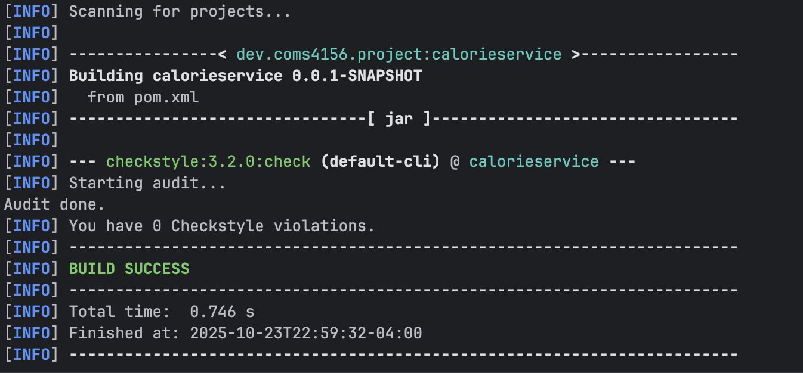

# 4156-Team-Project-2025 - Team Hello World
This is the GitHub repository for the **Team Project** associated with COMS 4156 Advanced Software Engineering.
Our group, **Hello World**, consists of the following members
- Arjun Somekawa (as7423)
- Jonathan Tavarez (jt3481)
- Songhee Beck (sb4446)
- Valentino Vitale (vv2343)

## Building and Running a Local Instance
In order to build and use our service you must install the following (This guide assumes MacOS but the Maven README has instructions for both Windows and Mac):

1. Maven 3.9.11: Run "mvn compile" and "mvn spring-boot:run". Running this command for the first time should install the necessary dependencies. If not use https://maven.apache.org/download.cgi to download and follow the installation instructions, be sure to set the bin as described in Maven's README according to instructions of your OS (see README).
2. JDK 17: This project used JDK 17 for development so that is what I recommend you use: https://www.oracle.com/java/technologies/javase/jdk17-archive-downloads.html
3. IntelliJ IDE: I recommend using IntelliJ but you are free to use any other IDE that you are comfortable with: https://www.jetbrains.com/idea/download/
4. When you open IntelliJ you have the option to clone from a GitHub repo, click the green code button and copy the http line that is provided there and give it to your IDE to clone.
5. That should be it in order to build the project with maven you can run <code>mvn -B package --file pom.xml</code> and then you can either run the tests via the test files described below or the main application by running SweProjectApplication.java from your IDE.
6. If you wish to run the style checker you can with <code>mvn checkstyle:check</code> or <code>mvn checkstyle:checkstyle</code> if you wish to generate the report.
7. If you wish to run the unit tests (which can be found in /CalorieService/src/test/java/dev/coms4156/project/calorieservice), you can with <code>mvn clean test</code> and <code>mvn jacoco:report</code>, which generates a report in /CalorieService/target/site/jacoco/index.html.
8. If you wish to run static analysis of the code base, you can with <code>mvn pmd:check</code>.
9. All CI/CD development logic for Github Actions are set up in /.github/workflows/java-build.yml, which tests code pushed to main or dev branches of your repo.

# List of all Functions, and Endpoints
## Food.java
### Variables
- foodName (string)
- foodId (int)
- calories (int)
- category (string)
### Functions

## Recipe.java
### Variables
- recipeName (string)
- recipeId (int)
- category (string)
- ingredients (list<Food>)
- views (int)
- likes (int)
### Functions

## User.java
### Variables
- username (string)
- userId (int)
- likedRecipes (list<int>)
### Functions

## Model.java
### Variables
### Functions

## Service.java
### Variables

### Functions
#### /food/alternative
* HTTP Method: GET
* Expected Input Parameters: foodId (int)
* Expected Output: foodAlternatives (ResponseEntity<?>)
* Returns 5 random foods of the same food category with lower calorie count.
* Status Codes:
  * 200 OK: Successfully retrieved food alternatives or no alternatives found
  * 404 NOT FOUND: Food with specified ID not found
  * 500 INTERNAL SERVER ERROR: Server error occurred

#### /recipe/alternative
* HTTP Method: GET
* Expected Input Parameters: recipeId (int)
* Expected Output: recipeAlternatives (ResponseEntity<?>)
* Returns 3 recipes of same recipe category with lower calorie count and 
highest views, as well as 3 random recipes of the same category with lower calorie count.
* Status Codes:
  * 200 OK: Successfully retrieved recipe alternatives
  * 404 NOT FOUND: Recipe with specified ID not found

#### /recipe/totalCalorie
* HTTP Method: GET
* Expected Input Parameters: recipeId (int)
* Expected Output: calorie (ResponseEntity<?>)
* Returns the estimated total calorie of a given recipe.
* Status Codes:
  * 200 OK: Successfully calculated total calories
  * 404 NOT FOUND: Recipe with specified ID not found

#### /recipe/calorieBreakdown
* HTTP Method: GET
* Expected Input Parameters: recipeId (int)
* Expected Output: calorieBreakdown (ResponseEntity<?>)
* Returns a dict of each ingredient in recipe and estimated calorie value for that ingredient.
* Status Codes:
  * 200 OK: Successfully retrieved calorie breakdown
  * 404 NOT FOUND: Recipe with specified ID not found

#### /user/recommend
* HTTP Method: GET
* Expected Input Parameters: userId (int)
* Expected Output: recipes (ResponseEntity<?>)
* Returns a list of 10 recommended recipes based on user's liked recipes.
* Status Codes:
  * 200 OK: Successfully retrieved recommendations or no recommendations found
  * 404 NOT FOUND: User with specified ID not found
  * 500 INTERNAL SERVER ERROR: Server error occurred

#### /user/recommendHealthy
* HTTP Method: GET
* Expected Input Parameters: userId (int), calorieMax (int)
* Expected Output: recipes (ResponseEntity<?>)
* Returns a list of 10 recommended recipes based on user's liked recipes under the calorieMax value.
* Status Codes:
  * 200 OK: Successfully retrieved healthy recommendations or no recommendations found
  * 404 NOT FOUND: User with specified ID not found
  * 500 INTERNAL SERVER ERROR: Server error occurred

#### /user/likeRecipe
* HTTP Method: POST
* Expected Input Parameters: userId (int), recipeId (int)
* Expected Output: status (ResponseEntity<?>)
* Adds a recipe to user's likedRecipes.
* Status Codes:
  * 200 OK: Recipe successfully added to user's liked recipes
  * 400 BAD REQUEST: User/recipe not found or recipe already liked
  * 500 INTERNAL SERVER ERROR: Server error occurred

#### /recipe/addRecipe
* HTTP Method: POST
* Expected Input Parameters: recipe (Recipe)
* Expected Output: status (ResponseEntity<?>)
* Adds a recipe to service.
* Status Codes:
  * 201 CREATED: Recipe successfully added
  * 400 BAD REQUEST: Recipe payload is invalid or recipe ID is missing
  * 409 CONFLICT: Recipe with specified ID already exists

#### /food/addFood
* HTTP Method: POST
* Expected Input Parameters: food (Food)
* Expected Output: status (ResponseEntity<?>)
* Adds a food to service.
* Status Codes:
  * 200 OK: Food successfully added
  * 400 BAD REQUEST: Food object is null, invalid, or ID already exists
  * 500 INTERNAL SERVER ERROR: Server error occurred

#### /recipe/viewRecipe
* HTTP Method: POST
* Expected Input Parameters: recipeId (int)
* Expected Output: status (ResponseEntity<?>)
* Increment Recipe's Views.
* Status Codes:
  * 200 OK: Recipe view successfully recorded
  * 404 NOT FOUND: Recipe with specified ID not found

#### /recipe/likeRecipe
* HTTP Method: POST
* Expected Input Parameters: recipeId (int)
* Expected Output: status (ResponseEntity<?>)
* Increment Recipe's likes.
* Status Codes:
  * 200 OK: Recipe like successfully recorded
  * 404 NOT FOUND: Recipe with specified ID not found

## Style Checking Report
I used the tool "checkstyle" to check the style of our code and generate style checking reports. Here is the report
as of the day of Oct 15, 2025. (These can be found in the reports folder):

## Branch Coverage Reporting
I used JaCoCo to perform branch analysis in order to see the branch coverage of the relevant code within the code base. See below
for screenshots demonstrating output.

## Static Code Analysis
I used PMD to perform static analysis on our codebase, see below for the most recent output.

This image was captured on Oct 15, 2025.

## Continuous Integration Report
This repository using GitHub Actions to perform continuous integration, to view the latest results go to the following link: https://github.com/Arjunj99/4156-Miniproject-2025-Students-part-3/actions

## Tools used 
This section includes notes on tools and technologies used in building this project, as well as any additional details if applicable.

* Maven Package Manager
* GitHub Actions CI
    * This is enabled via the "Actions" tab on GitHub.
    * Currently, this just runs a Maven build to make sure the code builds on branch 'main'.
* Checkstyle
    * I use Checkstyle for code reporting. Note that Checkstyle does get run as part of the CI pipeline.
* PMD
    * I am using PMD to do static analysis of our Java code.
* JUnit
    * JUnit tests get run automatically as part of the CI pipeline.
* MockMvc (API Testing)
    * I use MockMvc as our API testing framework for integration testing of REST endpoints. MockMvc is included with Spring Boot Test dependencies and requires no additional installation. MockMvc tests are located in RouteControllerTests.java and execute automatically when running `mvn clean test`. Test results are included in the JaCoCo coverage reports generated in /CalorieService/target/site/jacoco/index.html.
* JaCoCo
    * I use JaCoCo for generating code coverage reports.